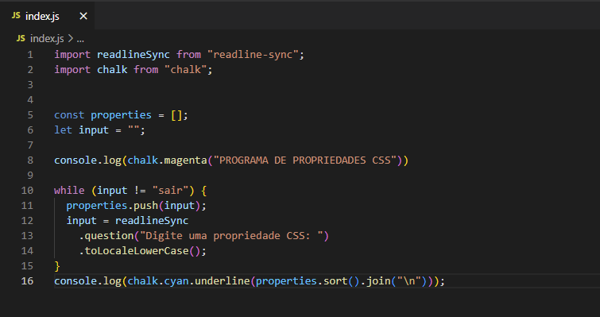
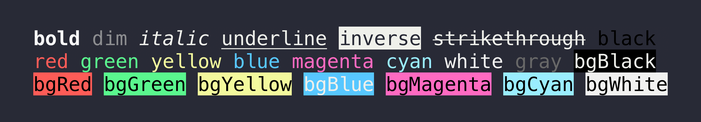
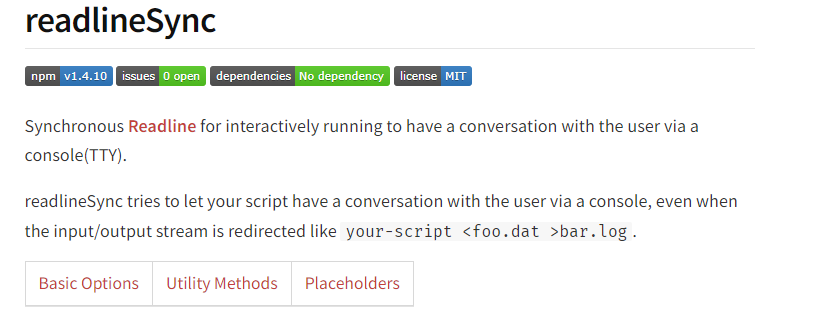
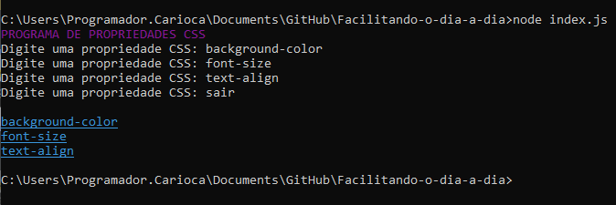

<h3> ➡️ O Projeto consiste na ordenação alfabética de propriedades de CSS. 
 </h3>
 <h2>👩🏽‍💻 O código</h2>
 <h4>É construído em Javascript especificando de modo que no terminal seja realizada a aplicação do código. O código deve rodar em um laço que vai receber propriedades até a pessoa digitar a palavra SAIR, quando isso acontecer vai ser impresso no terminal a lista das propriedades ordenadas de A-Z uma em cada linha.</h4>
 
 
 
 <h2> <b>Libs usadas</b>:  </h2> 

<h3>Chalk:  </h3>

 

<h3>Readline-sync:  </h3>

<h2>🔠Node.js</h2>
<h4>Através do Node.js é realizado a contrução do código que recebe uma lista de propriedades de CSS (ex: background-color, font-size, text-align) e devolve essa lista ordenada de A-Z.</h4>

<h3> <b>Para instalar as dependências<b>  </h3>
   

 npm install readline-sync 

 npm install chalk </p
